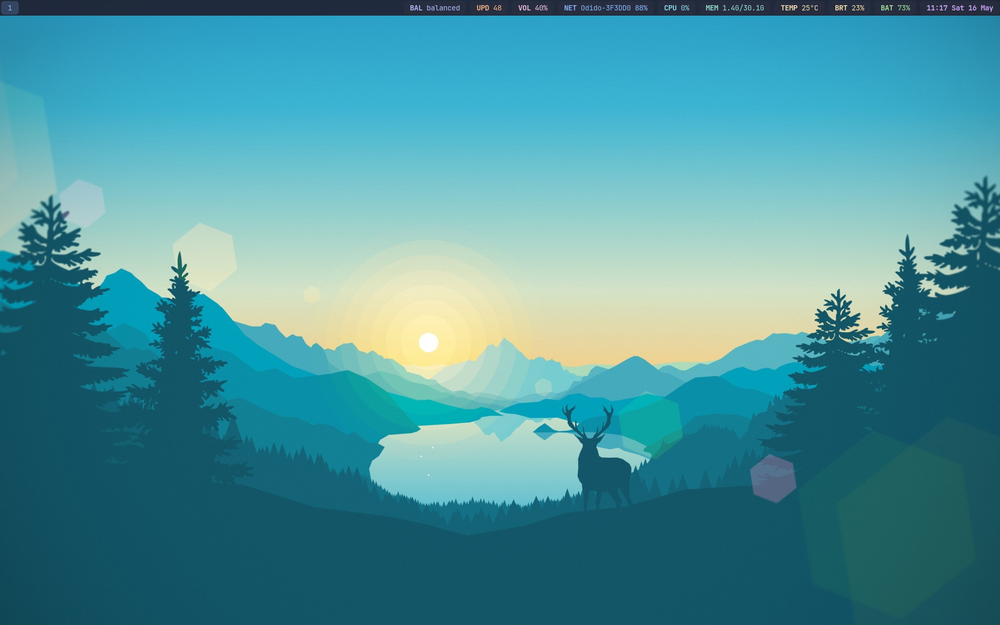
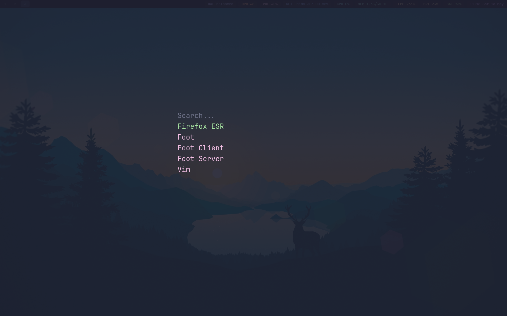
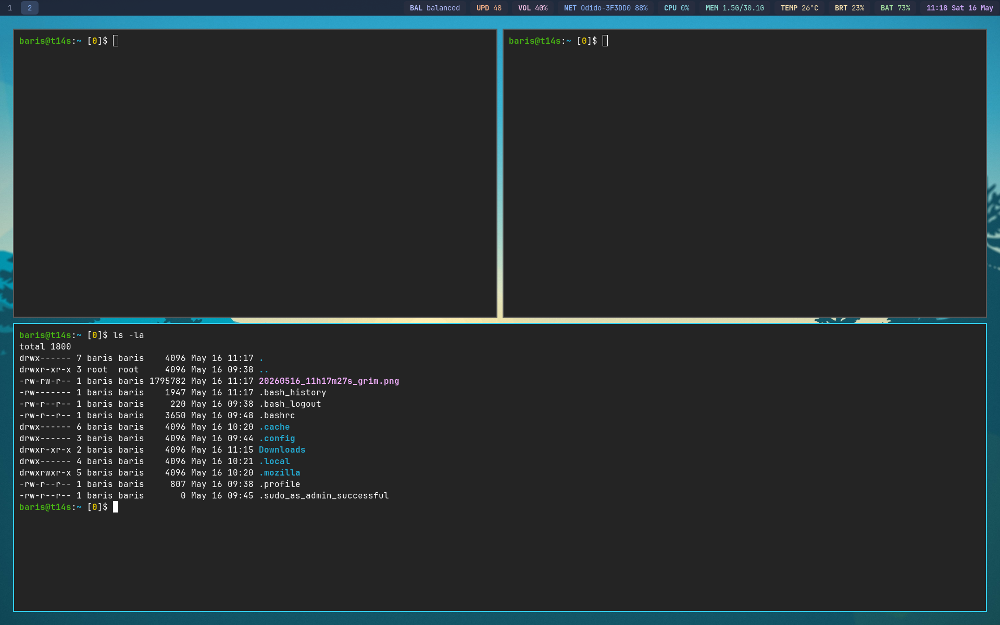

# ybarojs-debian

A Debian meta-package providing a complete Wayland desktop environment based on the Sway tiling window manager, featuring custom Catppuccin Mocha themed configurations.

**Architecture:** amd64 (x86_64) - Required for impala and yazi precompiled binaries

## Overview

**ybarojs-debian** simplifies the installation and configuration of a modern, minimalist Wayland desktop stack on Debian systems. It bundles essential components and applies consistent theming out of the box.

## Features

- **Sway** — A tiling Wayland compositor and drop-in replacement for the i3 window manager
- **Waybar** — Highly customizable Wayland bar for Sway and Wlroots based compositors (Catppuccin Mocha themed)
- **Tofi** — Fast and simple application launcher for Wayland (themed)
- **Greetd + sysc-greet** — Minimal and flexible display manager with a TUI greeter running in foot terminal (themed)
- **System-wide Configuration** — All configs installed to `/etc/xdg/` and `/etc/greetd/` for system-wide defaults
- **Automatic Font Installation** — JetBrainsMono Nerd Font and Noto core fonts included
- **Interactive Setup** — User sudo configuration prompt during installation
- **Display Manager Setup** — `greeter` user automatically added to `video`, `render`, and `input` groups for hardware access
- **Git** — Version control system (included as dependency)
- **Wireless Networking** — iwd wireless daemon with automatic service enable
- **WiFi Management** — impala TUI for managing wireless networks (downloaded during install)
- **Terminal File Manager** — yazi TUI file manager (downloaded during install)
- **Update Reminder** — Waybar module showing available firmware and package updates (UPD indicator)
- **Colored Bash Prompt** — Helper script to set up a beautiful colored PS1 in your terminal

## Screenshots

### Desktop



### Application Launcher (Tofi)



### Tiling Windows



## Dependencies

The following packages are automatically installed:

- `git` — Version control system
- `iwd` — Wireless networking daemon
- `dhcpcd` — DHCP client for network configuration
- `sudo` — User privilege escalation
- `sway` — Tiling Wayland compositor
- `brightnessctl` — Backlight and LED brightness control
- `grim` — Wayland screenshot utility
- `waybar` — Status bar with update reminder module
- `tofi` — Application launcher
- `greetd` — Minimal display manager
- `foot` — Terminal emulator for running sysc-greet
- `fwupd` — Firmware update daemon (for update reminder)
- `fonts-jetbrains-mono` — Primary UI font
- `fonts-noto-core` — Unicode coverage fonts
- `wireplumber` — PipeWire session manager
- `pipewire-pulse` — PulseAudio replacement
- `power-profiles-daemon` — Power profile management (balanced/performance/powersaver)
- `unzip` — Archive extraction utility

## Installation

### Option 1: Quick Install (Recommended)

Download and run the install script (interactive prompts require this method):

```bash
wget https://raw.githubusercontent.com/brsyuksel/ybarojs-debian/main/install.sh
chmod +x install.sh
./install.sh
```

Or clone and run locally:

```bash
git clone https://github.com/brsyuksel/ybarojs-debian.git
cd ybarojs-debian
./install.sh
```

### Option 2: Manual Install

Download the `.deb` package from the [releases page](https://github.com/brsyuksel/ybarojs-debian/releases) and install:

```bash
sudo dpkg -i ybarojs-debian_*.deb
```

If dependency errors occur, run:

```bash
sudo apt --fix-broken install
```

## Post-Installation

During installation, you will be prompted to configure sudo privileges. The package interactively asks which user should be granted sudo access for the desktop environment.

After installation, the display manager (greetd) will be available. Reboot or start the greetd service to access the graphical login:

```bash
sudo systemctl enable --now greetd
```

## File Locations

Configuration files are installed system-wide for all users:

| Component | Location |
|-----------|----------|
| Sway config | `/etc/xdg/sway/` |
| Waybar config | `/etc/xdg/waybar/` |
| Tofi config | `/etc/xdg/tofi/` |
| Foot config | `/etc/xdg/foot/` |
| Greetd config | `/etc/greetd/` |
| Nerd Fonts | `/usr/local/share/fonts/nerd-fonts/JetBrainsMono/` |

User-specific overrides can be placed in `~/.config/` following standard XDG conventions.

## Helper Scripts

The package includes several helper scripts installed to `/usr/local/bin/` and `/usr/local/share/ybarojs-debian/`:

| Script | Location | Purpose |
|--------|----------|---------|
| `ybarojs-update-check` | `/usr/local/bin/` | Checks for firmware and package updates (used by waybar) |
| `setup-colorful-prompt.sh` | `/usr/local/share/ybarojs-debian/` | Sets up colored bash prompt in `~/.bashrc` |
| `impala` | `/usr/local/bin/` | WiFi management TUI (downloaded during install) |
| `yazi` | `/usr/local/bin/` | Terminal file manager TUI (downloaded during install) |

## Features in Detail

### Update Reminder (Waybar)

The waybar includes an **UPD** (updates) module that shows the total count of available firmware and package updates:

- **Display**: Shows `UPD <count>` in the status bar
- **Tooltip**: Hover to see breakdown: `firmware: X, packages: Y`
- **Click**: Opens a terminal showing detailed update information
- **Update interval**: Every 5 minutes

The module checks:
- Firmware updates via `fwupdmgr`
- Package updates via `apt list --upgradable`

**Note**: On VMs (QEMU, VirtualBox, etc.), firmware checks are skipped to prevent hangs.

### Colored Bash Prompt

To enable a beautiful colored bash prompt with username, hostname, directory, and exit code:

```bash
/usr/local/share/ybarojs-debian/setup-colorful-prompt.sh
source ~/.bashrc
```

This will give you:
- 🟢 **Green**: username@hostname
- 🔵 **Blue**: current directory
- 🟡 **Yellow**: exit code of last command

### WiFi Management (impala)

After installation, use the `impala` command to manage WiFi networks:

```bash
impala
```

A TUI interface will open for connecting to wireless networks using iwd.

### Terminal File Manager (yazi)

After installation, use the `yazi` command to launch the terminal file manager:

```bash
yazi
```

A TUI interface will open for browsing and managing files.

## Post-Installation Steps

1. **Enable and start greetd** (if not already running):
   ```bash
   sudo systemctl enable --now greetd
   ```

2. **Log out and back in** (or reboot) to apply group memberships:
   - Your user is added to `sudo`, `video`, `render`, and `input` groups
   - These are required for Sway/Wayland to access GPU and input devices

3. **Enable colored prompt** (optional):
   ```bash
   /usr/local/share/ybarojs-debian/setup-colorful-prompt.sh
   source ~/.bashrc
   ```

4. **Check for updates** anytime by clicking the **UPD** indicator in waybar

## Troubleshooting

### Sway crashes after login

If Sway crashes ~20 seconds after logging in through sysc-greet:

1. Ensure your user is in the required groups:
   ```bash
   groups $USER
   ```
   
   You should see: `video`, `render`, `input`, `sudo`

2. If groups are missing, add them:
   ```bash
   sudo usermod -aG video,render,input,sudo $USER
   ```

3. **Log out completely** and log back in for group changes to take effect

### No WiFi networks showing

Ensure the iwd service is running:
```bash
sudo systemctl status iwd
sudo systemctl start iwd
```

### Update reminder not showing in waybar

Check if the script works manually:
```bash
/usr/local/bin/ybarojs-update-check
```

If you see errors, ensure `fwupd` and `apt` are installed and you have internet connectivity.

## CI/CD

This package is automatically built via GitHub Actions on every push to the main branch. The workflow:

1. Sets up a Debian build environment
2. Generates Debian metadata and control files
3. Packages configuration files into the proper directory structure
4. Builds the `.deb` package
5. Uploads artifacts for release

See `.github/workflows/build.yml` for the complete workflow definition.
